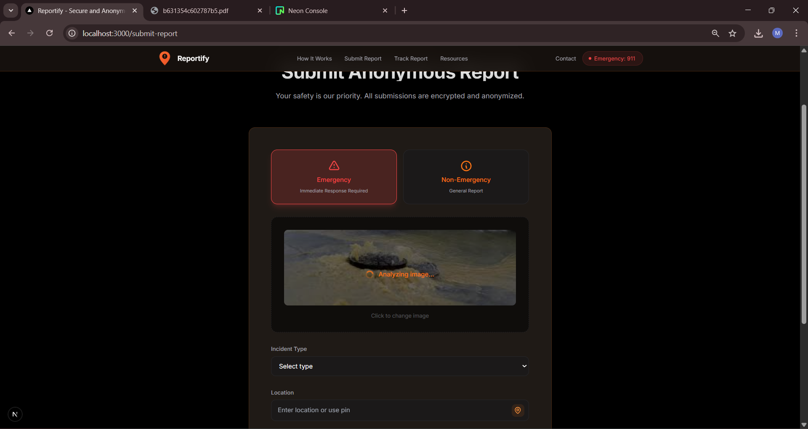
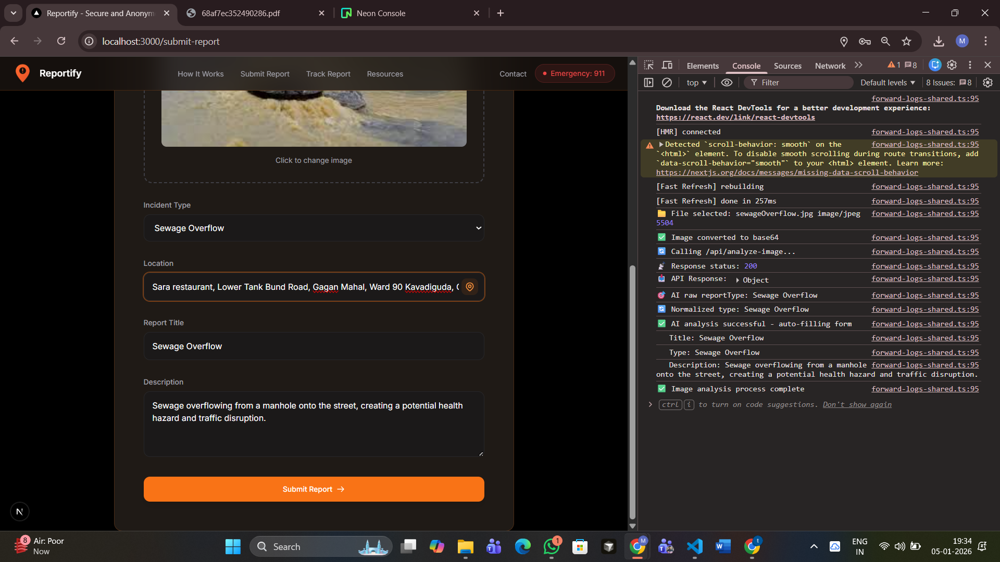
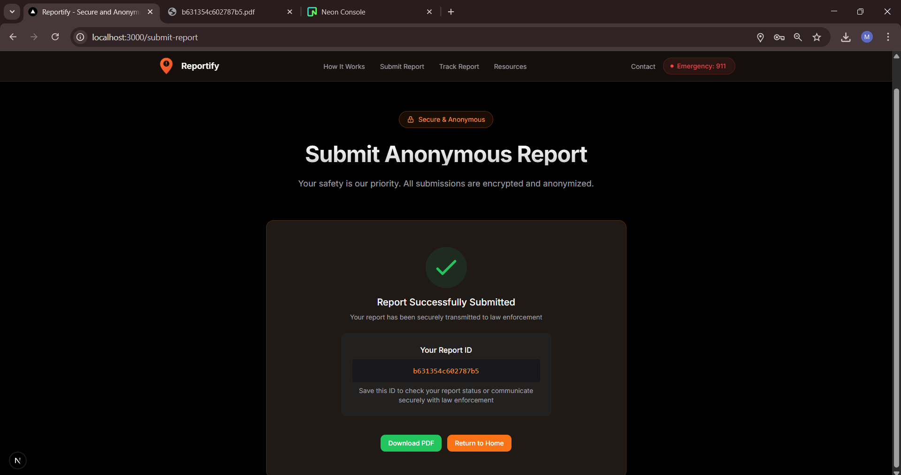
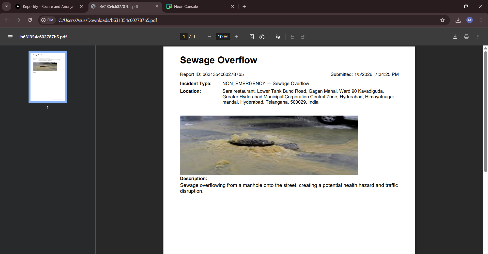
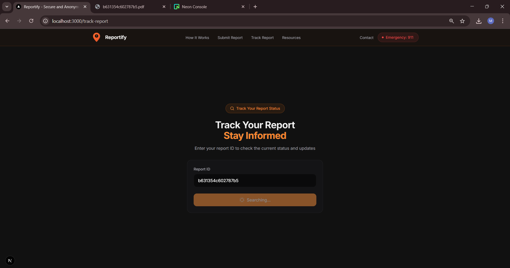
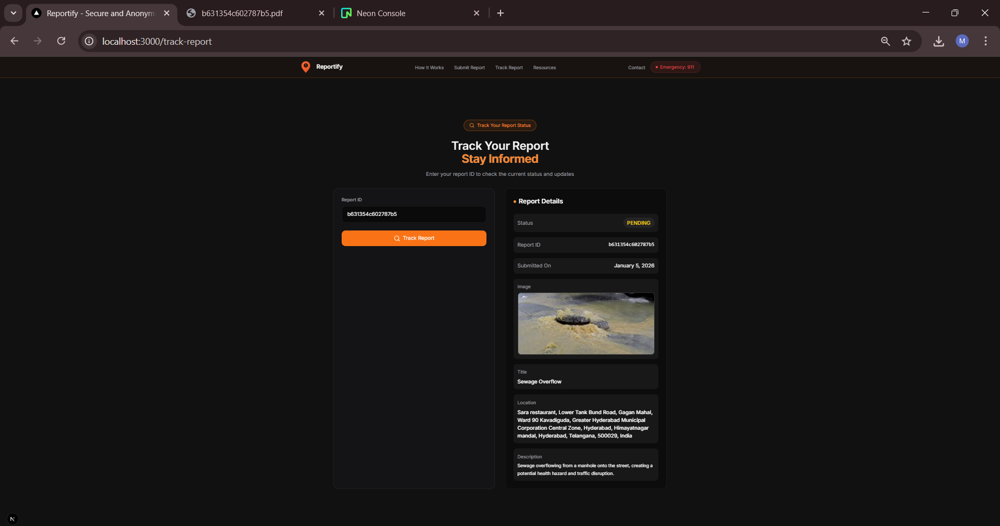
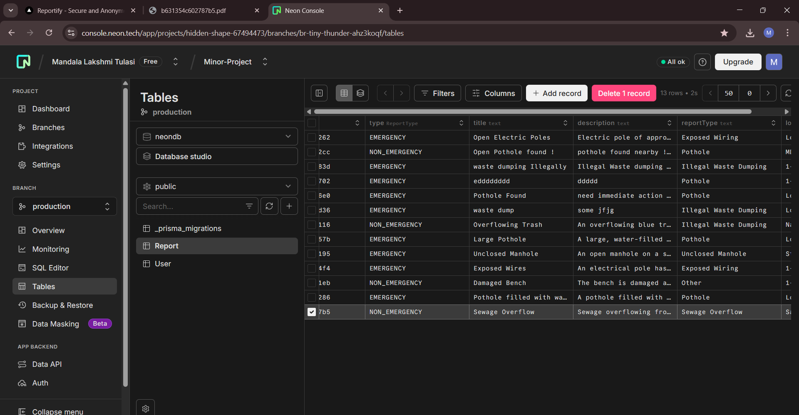

# 🚨 Reportify – Secure & Anonymous Issue Reporting Platform

Reportify is a secure, privacy-first web platform that enables users to report civic and public safety issues **anonymously**.  
The system focuses on user safety, encryption, and ease of reporting without exposing personal identity.

> ⚠️ **Note:** This project is currently under active development.  
> The screenshots below represent the latest UI and core features implemented so far.

---

## 🌟 Key Features

- 🔐 **Anonymous Reporting** – No personal identity required
- 📍 **Automatic Location Detection**
- 🖼️ **Image Upload & Analysis**
- 📄 **PDF Report Generation**
- 🔍 **Report Tracking using Report ID**
- 🗄️ **NeonDB (PostgreSQL) for secure storage**
- 🎨 Modern, responsive UI with smooth animations

---

## 🖥️ Application Screenshots

### 🏠 Landing Page
The main entry point highlighting anonymous reporting and the system’s purpose.

---

### 📝 Submit Report Page
Users can submit reports with descriptions, images, and location data.

---

### 📍 Location Detection
Automatically detects the user’s location to improve report accuracy.

---

### 🖼️ Image Analysis
Uploaded images are analyzed to assist authorities in understanding the reported issue.

---

### 📄 PDF Report Generation
After submission, a downloadable PDF report is generated.

---

### ⬇️ PDF Download
Users can download their submitted report for future reference.

---

### 🔍 Track Report Status
Users can track report progress using the unique Report ID.

---

### 🔎 Check Report Status
Check report progress using the Report ID provided in the generated PDF.

---

### 🗄️ Database (NeonDB – PostgreSQL)
All reports and metadata are securely stored using NeonDB (PostgreSQL).

---

## 🛠️ Tech Stack

- **Frontend:** Next.js, React, Tailwind CSS, Framer Motion  
- **Backend:** Node.js, API Routes  
- **Database:** NeonDB (PostgreSQL)  
- **Other:** PDF generation, Image handling, Location APIs

---

## 🚧 Project Status

🔧 **In Progress**  
More features, validations, and optimizations are actively being developed.

---

## 👩‍💻 Author

**Lakshmi Tulasi Mandala**  
BSMS Student | Full Stack & AI Enthusiast  

---

⭐ If you like this project, consider giving it a star!
